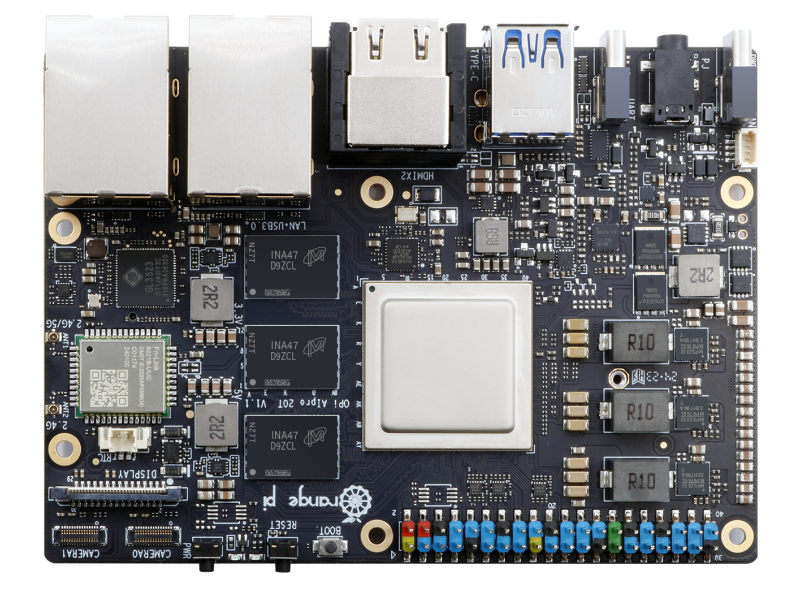

# Linux for Orange Pi AI Pro 20T

Orange Pi AI Pro 20T: [产品官方介绍](http://www.orangepi.org/html/hardWare/computerAndMicrocontrollers/details/Orange-Pi-AIpro(20t).html)

## 仓库

| 组件 | 仓库 |
| --- | --- |
| Linux 内核源码 | [HwHiAiUser/linux-opiai](https://github.com/HwHiAiUser/linux-opiai) |
| Kernel 构建仓库 | [HwHiAiUser/kernel-build-opiai](https://github.com/HwHiAiUser/kernel-build-opiai) |
| Armbian 构建仓库 | [HwHiAiUser/armbian-opiai](https://github.com/HwHiAiUser/armbian-opiai) |
| OpenWrt 构建仓库 | [HwHiAiUser/openwrt-opiai](https://github.com/HwHiAiUser/openwrt-opiai) |

## 当前支持状态

| 功能 | Linux 5.10 (official) | Linux 6.18.y |
| --- | --- | --- |
| USB | ✅ 已支持 | ✅ 已支持 | 
| PCIe | ✅ 已支持 | ✅ 已支持 | 
| 2.5G 网卡 (RTL8125) | ✅ 已支持 | ✅ 已支持 | 
| 无线 WiFi (RTW88) | ✅ 已支持 | ⚠️ 待测试 | 
| 风扇控制 | ✅ 已支持 | ✅ 已支持 | 
| NPU (Ascend 310B) | ✅ 已支持 | ⚠️ 待测试 | 
| HDMI | ✅ 已支持 | ❌ 不支持 | 
